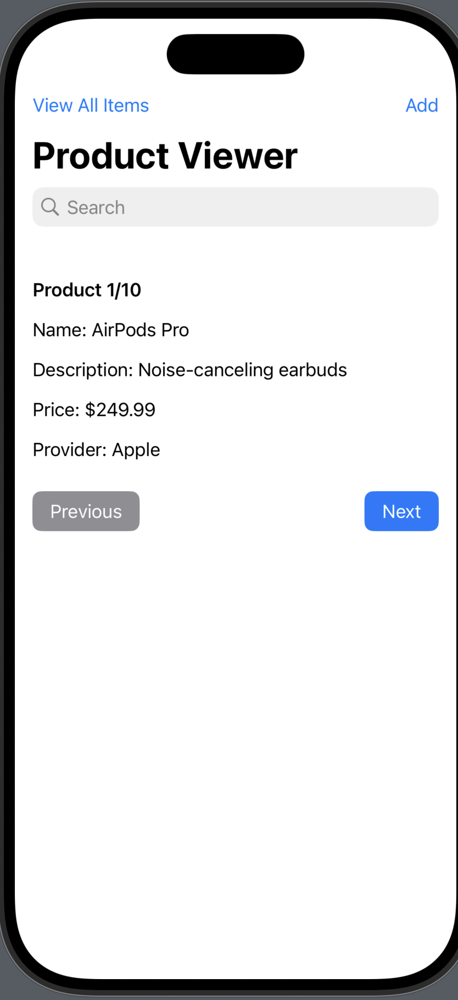
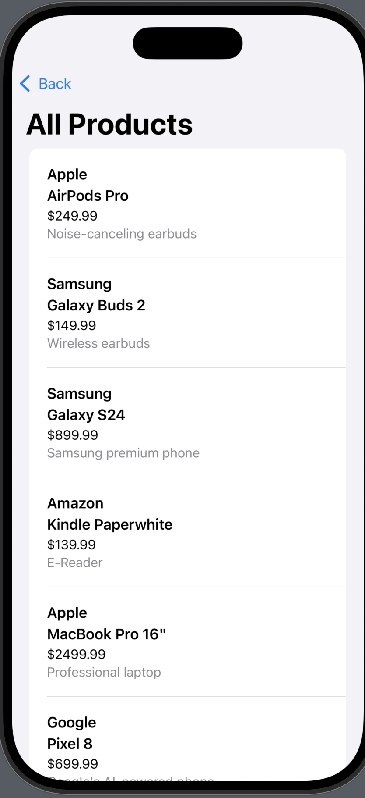
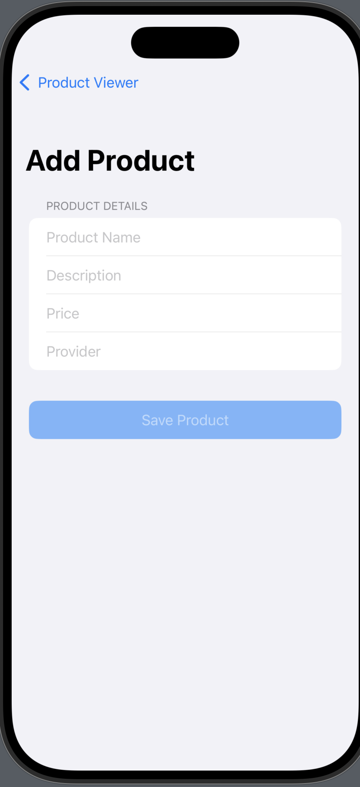

# A2_iOS_Brendan_101447806

## 📱 Product Viewer App (iOS – Core Data)

This iOS application was created for **Lab Assignment 2** in the Full Stack Development program. It allows users to view, search, add, and manage a list of products using **Core Data** for local storage.

---

## 👨‍💻 Author

**Brendan Dasilva**  
**Student ID**: 101447806

---

## ✨ Features

- ✅ View details of saved products (Name, Description, Price, Provider)
- ✅ Navigation through products using **Previous** and **Next** buttons
- ✅ Search bar to find products by name, description, or provider
- ✅ Add new products with validation
- ✅ Swipe to edit or delete products from the full list
- ✅ Polished layout with aligned content and responsive navigation
- ✅ Core Data integration for persistent storage

---

## 📦 Technologies Used

- `SwiftUI`
- `Core Data`
- `Xcode`

---

## 📸 Screenshots

| Product Viewer                    | Product List                  | Add Product                 |
| --------------------------------- | ----------------------------- | --------------------------- |
|  |  |  |

---

## 🚀 Setup & Run Instructions

1. Clone this repository:

   ```bash
   git clone https://github.com/yourusername/A2_iOS_Brendan_101447806.git
   ```

2. Open the project in **Xcode**.

3. Run the app on a simulator or physical iPhone.

---

## 📂 File Structure Overview

```
A2_iOS_Brendan_101447806/
├── AddProductView.swift
├── ContentView.swift
├── ProductListView.swift
├── CoreData Models
├── Assets.xcassets
└── README.md
```

---

## 🏁 Final Notes

This app was created as part of a lab assignment to demonstrate the use of **Core Data**, SwiftUI UI design, and good software development practices. All core requirements were implemented with attention to functionality and visual design.
